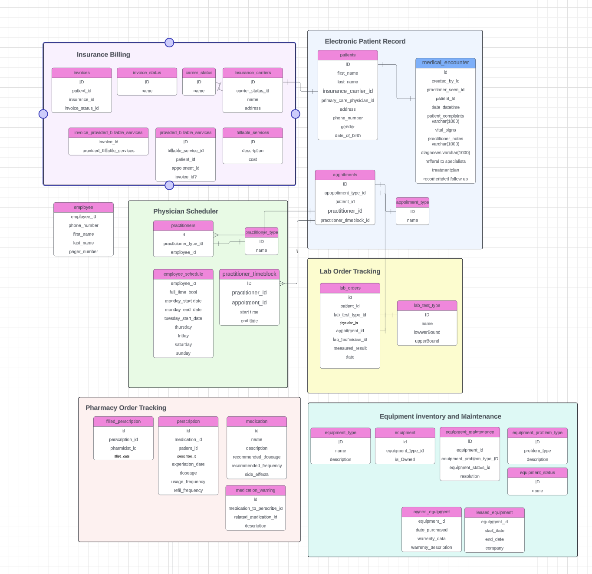

# Health-Track

## Team Members

- **Joshua Constine** - Project Manager
- **Ruben Guillen** - Design Manager
- **Stephen Parker** - Database Manager
- **Anthony Corona** - Test Manager
- **Mohamed Boughou** - Software Developer
- **Talia Goody** - Requirements Manager
- **Omar Bazr** - Requirements Manager
- **Kane Cruz-Walker** - Software Developer

## System Requirements

- Docker installed

## Architecture

- **Frontend**: Bootstrapped with [Create React App](https://react.dev/)
- **Backend**: Express application ([Express.js](https://expressjs.com/))
- **Database**: MySQL ([MySQL Documentation](https://dev.mysql.com/doc/))

### Docker Images

| Resource   | Image             |
|------------|-------------------|
| Frontend   | node:18-alpine     |
| Backend    | node:18-alpine     |
| Database   | mysql:8.0          |

## Running the Project

1. Clone the repo:  
   `https://github.com/joshconstine/Health-Track`

2. Navigate to the project directory via terminal and execute:
   ```bash
   docker-compose up
- Open Docker Desktop to verify all containers are running:


From here, you can have command line access into any of the containers.

## Database Setup



The first time you start the project, you will need to seed the database with the project schema.

- Establish a connection to the `db` container.
- Execute the `/db/schema.sql` file to create all entities and relationships.
- Execute the `/db/seed/setup.sql` file to create add all aplication data.
- Execute the `/db/seed/patients.sql` file to insert the patient data.

## Connecting to the Database
Once the `db` container is running, you can connect using a range of tools.

The port and admin login information can be found in the `docker-compose.yml` file.
